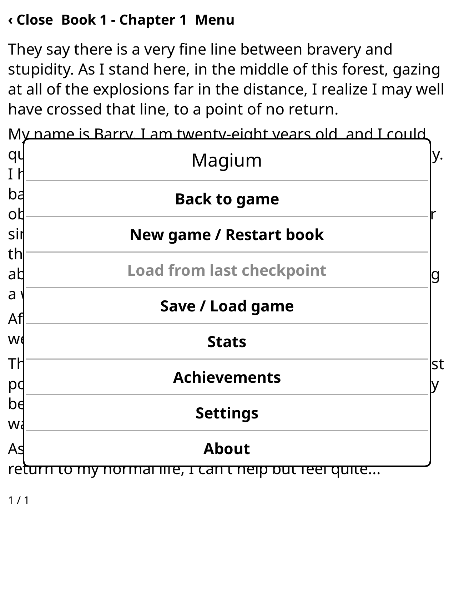
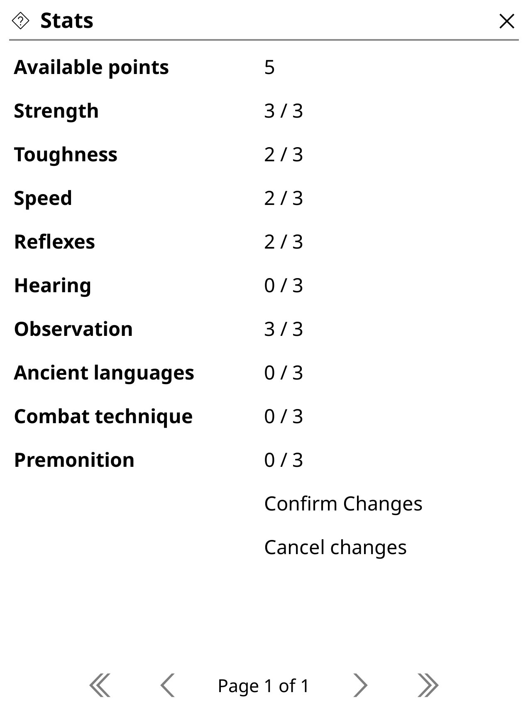
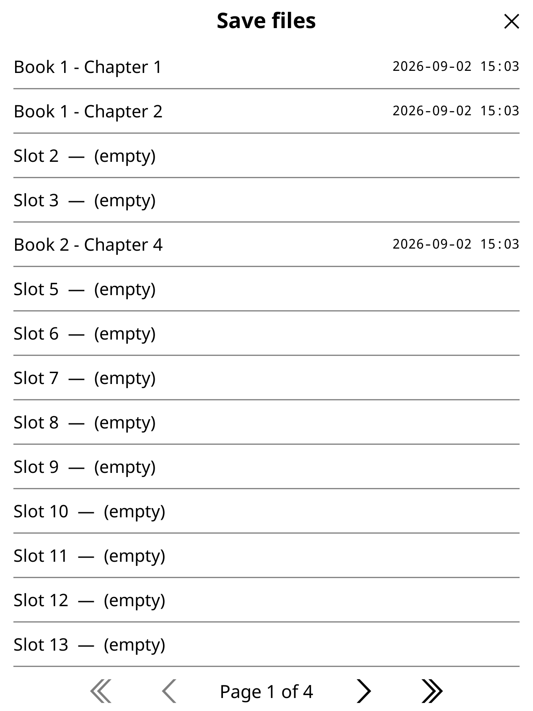
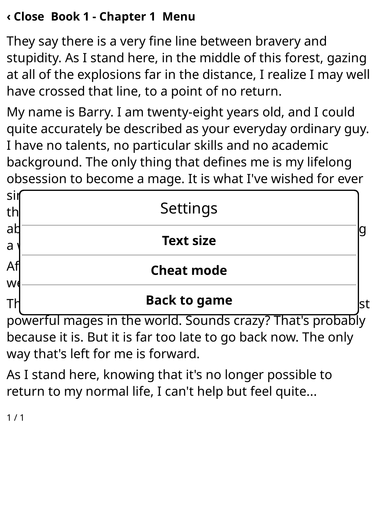
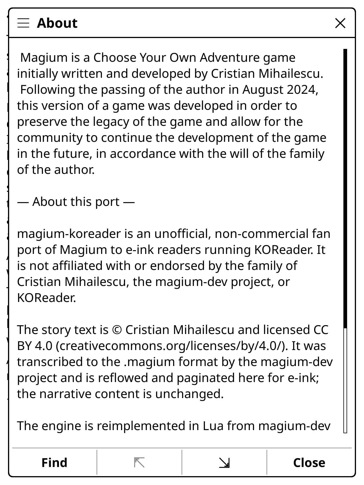

# magium-koreader

Play **[Magium](https://github.com/raduprv/Magium)** — the text-based
choose-your-own-adventure game by the late Cristian Mihailescu — on a **Kindle,
Kobo, or any e-reader running [KOReader](https://github.com/koreader/koreader)**.

All three books, offline, with saves, a stat system, and achievements — as a
single KOReader plugin. The story is bundled; there is nothing else to download.

<p align="center">
  
  &nbsp;&nbsp;
  
</p>

> **Unofficial, non-commercial fan project.** Not affiliated with or endorsed by
> the family of Cristian Mihailescu, the magium-dev or magium-recrystallized
> projects, or KOReader.

## What you get

- **The complete story** — Books 1–3, every branch, bundled as `.magium` script
  files (~7.7 MB).
- **A reading UI built for e-ink** — full-page paginated prose, tap left/right to
  turn, tap the header for the menu; refresh tuned to avoid ghosting.
- **Saves** — a rolling autosave plus 50 manual slots and a per-book checkpoint.
- **Stats & stat checks** — the point-allocation screen, faithfully ported, with
  every in-story gate.
- **Achievements** — a 3-level browser over all 136, with unlock toasts.
- **Settings** — three prose text sizes, and a cheat-mode toggle.

## Screenshots

| In-game menu | Stats | Achievements |
|---|---|---|
|  |  |  |
| **Save slots** | **Settings** | **About** |
|  |  |  |

## Quick start

You need a device running KOReader. **Reference build:** Kindle Paperwhite 12
(2024), KOReader `v2026.07.1`. Other devices and builds are untested but should
work — [tell us if yours doesn't](CONTRIBUTING.md).

1. Download `magium-koreader-v1.0.zip` from the
   [latest release](https://github.com/lettuceketchup/magium-koreader/releases/latest).
2. Unzip it and copy the `magium.koplugin/` folder into KOReader's `plugins/`
   folder on your device:

   ```
   koreader/plugins/magium.koplugin/
   ```
3. **Fully restart KOReader** (exit and reopen — there is no hot reload).
4. Open it: **File browser → ≡ menu → Magium**.

The first open each session takes ~2 seconds while the story loads; every open
after that is instant. Progress autosaves on close and suspend.

Full instructions, the over-WiFi deploy path, and where saves live on the
device: **[INSTALL.md](INSTALL.md)**.

## Contributing

Testers, coders, e-ink/KOReader specialists, and fans are all welcome. In
particular: **if Magium misbehaves on an e-reader other than the Paperwhite 12,
open an issue** — that is exactly the kind of report this project wants.

- **[CONTRIBUTING.md](CONTRIBUTING.md)** — how to report a bug, and the full
  build / test / deploy guide.
- **[CLAUDE.md](CLAUDE.md)** — the architecture and working rules, in one file.
- **[docs/specs/](docs/specs/)** — the implementation spec (start with
  `2026-08-31-plugin-architecture-and-phase-i.md`) and the per-phase specs.
- **[docs/decisions/](docs/decisions/)** — why the port is built the way it is.

Forking it to continue the work is welcome too.

## How this was built

This port was built **largely with AI assistance** (Claude Code): the Lua
engine, the KOReader UI, the test suites, the tooling, this release, and most of
these docs. A human directed the work, made the decisions, and verified every
release on real hardware. Development, bug fixes, and code review continue to use
AI the same way. See [CONTRIBUTING.md](CONTRIBUTING.md#how-ai-is-used-here).

## Credit

**Magium was created by [Cristian Mihailescu](https://github.com/raduprv/Magium)**
(1996–2024). After his passing, his family released the game and **licensed all
of its story text [CC BY 4.0](https://creativecommons.org/licenses/by/4.0/)** so
the community could preserve, translate, and continue it — which is what this
port does.

- The **story text** is copied from
  [magium-dev](https://github.com/thuiop/magium-dev), which transcribed the
  original into the `.magium` scene format. It is © Cristian Mihailescu, CC BY
  4.0; this port reflows and paginates it for e-ink, and the narrative content is
  unchanged.
- The **engine** is a Lua reimplementation of magium-dev's engine (MIT).
- The **platform** is [KOReader](https://github.com/koreader/koreader) (AGPL-3.0).

Full attribution and the third-party licence texts:
**[THIRD-PARTY-NOTICES.md](THIRD-PARTY-NOTICES.md)**.

Community: [r/Magium](https://www.reddit.com/r/Magium/) ·
[Magium Discord](https://discord.com/invite/cF3EDRmK)

## Licence

- This port's **code, docs, and tooling**: **AGPL-3.0-or-later**
  ([LICENSE](LICENSE)) — matching KOReader, into which the plugin loads.
  ([ADR-008](docs/decisions/ADR-008-license-and-distribution.md))
- The bundled **Magium story text**: **CC BY 4.0**, © Cristian Mihailescu — not
  relicensed.

## Project history

`magium-koreader` began as a research and design effort before a line of plugin
code was written. That dossier — the feasibility study, the approach comparison,
the spikes, and the dated running log — is archived under
**[docs/archive/](docs/archive/)**. It isn't needed to use or work on the plugin.
